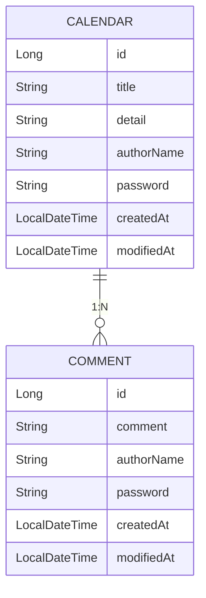

# 📅 Calendar App (Spring Boot REST API)


> **일정 관리 앱 API**
> 일정과 댓글을 함께 관리할 수 있는 **Spring Boot 기반 백엔드 프로젝트**입니다.
> 비밀번호 검증, 예외 처리, Fetch Join 최적화, JPIAuditing 자동화까지 완성된 구조입니다.

---

## 🧩 프로젝트 개요

| 항목             | 내용                                |
| -------------- | --------------------------------- |
| **프로젝트명**      | Calendar App                      |
| **개발 기간**      | 2025.10 ~ 2025.11                 |
| **언어 / 프레임워크** | Java 17 / Spring Boot 3.5.7       |
| **DB / ORM**   | MySQL 8.0 / Spring Data JPA       |
| **빌드 도구**      | Gradle                            |
| **API 테스트 도구** | Postman                           |
| **목표 단계**      | Lv.6 (단건 조회 시 댓글 리스트 응답 + N+1 해결) |

---

## 🎯 주요 기능

### 📆 일정 (Calendar)

* 일정 등록 (POST `/calendars/create`)
* 전체 조회 + 작성자명 필터 (GET `/calendars`)
* 단건 조회 (댓글 포함)
* 일정 수정 (비밀번호 검증, 제목·작성자명만 변경)
* 일정 삭제 (비밀번호 검증 후 삭제)

### 💬 댓글 (Comment)

* 일정별 댓글 등록 (최대 10개 제한)
* 일정 조회 시 댓글 함께 조회
* 일정 삭제 시 Cascade 삭제 자동 적용

---

## ⚙️ ERD 구조

> 일정(`Calendar`) 1개에 댓글(`Comment`) 여러 개가 연결되는 1:N 구조입니다.



📸 **ERD 예시 (MySQL Workbench)**


---

## 🧱 API 명세서
# 📅 일정 생성 (POST)

### 1\. 🔍 API 개요 (Overview)

| 구분 | 내용 |
| --- | --- |
| **요청 유형** | `POST` |
| **엔드포인트** | `http://localhost:8080/calendars/create` |
| **목적** | 클라이언트가 입력한 일정 정보를 서버가 받아 데이터베이스에 **새로운 일정/게시물**을 생성하고 저장합니다. |

---

### 2\. 📑 요청 본문 (Request Body) 명세

요청 시 반드시 포함해야 하는 **JSON 데이터 형식**입니다.

| 필드명 | 타입 | 필수 여부 | 설명 |
| --- | --- | --- | --- |
| `title` | String | O | 일정/게시물의 제목 |
| `detail` | String | O | 상세 내용 |
| `authorName` | String | O | 작성자 이름 |
| `password` | String | O | 수정/삭제 시 사용할 비밀번호 |

#### **3\. 요청 예시 (JSON)**

``` json
{
   "title" : "테스트",
    "detail" : "테스트1",
    "authorName" : "테스트 이름 1",
    "password" : "123456"
}

 ```

#### **4\. 응답 예시 (JSON)**

``` json
{
    "id": 11,
    "title": "테스트",
    "detail": "테스트1",
    "authorName": "테스트 이름 1",
    "createdAt": "2025-11-06T15:03:05.633274",
    "modifiedAt": "2025-11-06T15:03:05.633274"
}

 ```
---
# 📅 일정 수정 (PATCH)

### 1\. 🔍 API 개요 (Overview)

| 구분 | 내용 |
| --- | --- |
| **요청 유형** | `POST` |
| **엔드포인트** | `http://localhost:8080/calendars/{id}` |
| **목적** | 저장된 데이터의 제목과 작성자이름을 수정 할수 있도록 합니다. |

---

### 2\. 📑 요청 본문 (Request Body) 명세

요청 시 반드시 포함해야 하는 **JSON 데이터 형식**입니다.

| 필드명 | 타입 | 필수 여부 | 설명 |
| --- | --- | --- | --- |
| `title` | String | O | 일정/게시물의 제목 |
| `authorName` | String | O | 작성자 이름 |
| password | String | O | 비밀번호 |

#### **3\. 요청 예시 (JSON)**

``` json
{
   "title" : "테스트",
   "authorName" : "테스트 이름 1"
   "password": "abcd1234"
}

 ```

#### **4\. 응답 예시 (JSON)**

``` json
{
    "id": 1,
    "title": "테스트",
    "detail": "테스트1",
    "authorName": "테스트 이름 1",
    "createdAt": "2025-11-06T15:03:05.633274",
    "modifiedAt": "2025-11-06T15:03:05.633274"
}

 ```

#### **5\. 비밀번호 오류 (JSON)**

``` json
{
  "timestamp": "2025-11-06T10:31:00",
  "status": 403,
  "error": "Forbidden",
  "message": "누구냐 넌!",
  "path": "/calendars/1"
}

 ```
---
# 📅 단건 조회(GET)-댓글 포함

### 1\. 🔍 API 개요 (Overview)

| 구분 | 내용 |
| --- | --- |
| **요청 유형** | `GET` |
| **엔드포인트** | `http://localhost:8080/calendars/{id}` |
| **목적** | 고유식별번호 ID 번호를 통해 1건의 일정만 조회 하고 해당 일정의 댓글 또한 같이 확인 할수 있다. |

---

### 2\. 📑 요청 본문 (Request Body) 명세

요청 시 반드시 포함해야 하는 **JSON 데이터 형식**입니다.

| 필드명 | 타입 | 필수 여부 | 설명 |
| --- | --- | --- | --- |
| `title` | String | O | 일정/게시물의 제목 |
| `authorName` | String | O | 작성자 이름 |
| password | String | O | 비밀번호 |

#### **3\. 요청 예시 (JSON)**

``` json
{
   "title" : "테스트",
   "authorName" : "테스트 이름 1"
   "password": "abcd1234"
}

 ```

#### **4\. 응답 예시 (JSON)**

``` json
{
    "id": 1,
    "title": "테스트",
    "detail": "테스트1",
    "authorName": "테스트 이름 1",
    "createdAt": "2025-11-06T15:03:05.633274",
    "modifiedAt": "2025-11-06T15:03:05.633274"
    "comments" : [ 
         {
            "id": 1,
            "comment": "댓글 테스트1",
            "authorName": "댓글 테스트 이름1",
            "createdAt": "2025-11-06T09:40:15.541048",
            "modifiedAt": "2025-11-06T09:40:15.541048"
         },
         {
            "id": 1,
            "comment": "댓글 테스트1",
            "authorName": "댓글 테스트 이름1",
            "createdAt": "2025-11-06T09:40:15.541048",
            "modifiedAt": "2025-11-06T09:40:15.541048"
         }
    ]
}

 ```
---
# 📅 작성자명 조회(GET)-댓글 포함

### 1\. 🔍 API 개요 (Overview)

| 구분 | 내용 |
| --- | --- |
| **요청 유형** | `GET` |
| **엔드포인트** | `http://localhost:8080/`calendars?authorName=이름 |
| **목적** | 작성자이름을 통해1건의 일정만 조회 하고 해당이름으로 여러개의 일정이 있다면 전부 조회 할수 있다.  <br>그리고 일정에 포함된 댓글 또한 같이 확인 할수 있다. |

---

### 2\. 📑 요청 본문 (Request Body) 명세

요청 시 반드시 포함해야 하는 **JSON 데이터 형식**입니다.

| 필드명 | 타입 | 필수 여부 | 설명 |
| --- | --- | --- | --- |
| `title` | String | O | 일정/게시물의 제목 |
| `authorName` | String | O | 작성자 이름 |
| password | String | O | 비밀번호 |

#### **3\. 요청 예시 (JSON)**

``` json
{
   "title" : "테스트",
   "authorName" : "테스트 이름 1"
   "password": "abcd1234"
}

 ```

#### **4\. 응답 예시 (JSON)**

``` json
{
    "id": 1,
    "title": "테스트",
    "detail": "테스트1",
    "authorName": "테스트 이름 1",
    "createdAt": "2025-11-06T15:03:05.633274",
    "modifiedAt": "2025-11-06T15:03:05.633274"
    "comments" : [ 
         {
            "id": 1,
            "comment": "댓글 테스트1",
            "authorName": "댓글 테스트 이름1",
            "createdAt": "2025-11-06T09:40:15.541048",
            "modifiedAt": "2025-11-06T09:40:15.541048"
         },
         {
            "id": 1,
            "comment": "댓글 테스트1",
            "authorName": "댓글 테스트 이름1",
            "createdAt": "2025-11-06T09:40:15.541048",
            "modifiedAt": "2025-11-06T09:40:15.541048"
         }
    ]
}

 ```
---
# 📅 일정 삭제(DELETE)

### 1\. 🔍 API 개요 (Overview)

| 구분 | 내용 |
| --- | --- |
| **요청 유형** | DELETE |
| **엔드포인트** | `http://localhost:8080/calendars/{id}` |
| **목적** | 고유식별번호 ID 번호를 통해 1건의 일정씩 삭제 할수 있다. |
| 인증 | 생성당시 비밀번호 오류일시 더티체킹으로 400오류코드 전달 |

---

### 2\. 📑 요청 본문 (Request Body) 명세

요청 시 반드시 포함해야 하는 **JSON 데이터 형식**입니다.

| 필드명 | 타입 | 필수 여부 | 설명 |
| --- | --- | --- | --- |
| password | String | O | 비밀번호 |

#### **3\. 요청 예시 (JSON)**

``` json
{
   "password": "abcd1234"
}

 ```

#### **4\. 응답 예시 (JSON)**

``` json
{
    "id": 1,
    "title": "테스트",
    "detail": "테스트1",
    "authorName": "테스트 이름 1",
    "createdAt": "2025-11-06T15:03:05.633274",
    "modifiedAt": "2025-11-06T15:03:05.633274"
    "comments" : [ 
         {
            "id": 1,
            "comment": "댓글 테스트1",
            "authorName": "댓글 테스트 이름1",
            "createdAt": "2025-11-06T09:40:15.541048",
            "modifiedAt": "2025-11-06T09:40:15.541048"
         },
         {
            "id": 1,
            "comment": "댓글 테스트1",
            "authorName": "댓글 테스트 이름1",
            "createdAt": "2025-11-06T09:40:15.541048",
            "modifiedAt": "2025-11-06T09:40:15.541048"
         }
    ]
}

 ```

#### **5\. 비밀번호 오류 (**403 Forbidden**)**

``` json
{
  "timestamp": "2025-11-06T10:31:00",
  "status": 403,
  "error": "Forbidden",
  "message": "누구냐 넌!",
  "path": "/calendars/1"
}

 ```

---

# 🧾댓글 생성(POST)

### 1\. 🔍 API 개요 (Overview)

| 구분 | 내용 |
| --- | --- |
| **요청 유형** | `POST` |
| **엔드포인트** | `http://localhost:8080/{id}/`comment |
| **목적** | 고유식별번호 ID를 통해 해당 일정에 댇글을 생성할수 있다. |

---

### 2\. 📑 요청 본문 (Request Body) 명세

요청 시 반드시 포함해야 하는 **JSON 데이터 형식**입니다.

| 필드명 | 타입 | 필수 여부 | 설명 |
| --- | --- | --- | --- |
| `title` | String | O | 일정/게시물의 제목 |
| `authorName` | String | O | 작성자 이름 |
| password | String | O | 비밀번호 |

#### **3\. 요청 예시 (JSON)**

``` json
{
  "comment": "이 강의 정말 유익하네요!",
  "authorName": "김춘배",
  "password": "1234"
}

 ```

#### **4\. 응답 예시 (JSON)**

``` json
{
    "id": 6,
    "comment": "이 강의 정말 유익하네요!",
    "authorName": "김춘배",
    "createdAt": "2025-11-06T13:32:14.961453",
    "modifiedAt": "2025-11-06T13:32:14.961453"
}

 ```

#### **5 댓글 10개 초과시 (**400 Bad Request**)**

``` json
{
  "timestamp": "2025-11-06T10:41:00",
  "status": 400,
  "error": "Bad Request",
  "message": "일정 1개당 댓글은 최대 10개까지만 등록 가능합니다.",
  "path": "/calendars/1/comment"
}

 ```


---


## 🧠 기술 설계 개요

### 🔹 3-Layer Architecture

```
Controller → Service → Repository
```

* **Controller** : 요청/응답 처리
* **Service** : 트랜잭션, 비즈니스 로직
* **Repository** : DB 접근 (JPA)


---


### 🧩 프로젝트 구조
src/main/java/com/calendarapp
 ┣ 📂 controller
 ┃ ┗ CalendarController.java
 ┣ 📂 service
 ┃ ┣ CalendarService.java
 ┃ ┗ CommentService.java
 ┣ 📂 repository
 ┃ ┣ CalendarRepository.java
 ┃ ┗ CommentRepository.java
 ┣ 📂 entity
 ┃ ┣ Calendar.java
 ┃ ┣ Comment.java
 ┃ ┗ BaseEntity.java
 ┣ 📂 dto
 ┃ ┣ Create / Modify / Delete / Get / Comment DTOs
 ┗ CalendarAppApplication.java


---


### 🧩 DTO 구조

* Request DTO: 클라이언트 요청 데이터 수신
* Response DTO: 비밀번호 제거 후 응답

```java
@Getter
public class DeleteCalendarRequest {
    private String password;
}
```


---


## 🧰 실행 방법

```bash
# 1️⃣ MySQL 실행 후 DB 생성
CREATE DATABASE calendars CHARACTER SET utf8mb4 COLLATE utf8mb4_unicode_ci;

# 2️⃣ application.properties 설정
spring.datasource.url=jdbc:mysql://localhost:3306/calendars?serverTimezone=Asia/Seoul
spring.datasource.username=root
spring.datasource.password=12345678

# 3️⃣ 실행
./gradlew bootRun
```


---


### 🔒 비밀번호 검증 로직

```java
if (!calendar.getPassword().equals(request.getPassword())) {
    throw new ResponseStatusException(HttpStatus.FORBIDDEN, "누구냐 넌!");
}
```


---


### 🚀 Fetch Join (N+1 문제 해결)

```java
@Query("SELECT c FROM Calendar c LEFT JOIN FETCH c.comments WHERE c.id = :id")
Optional<Calendar> findByIdWithComments(@Param("id") Long id);
```

> 댓글이 많은 일정 조회 시에도 쿼리 1번으로 모든 데이터를 가져옵니다.


---


### 🧭 Auditing 자동화

`BaseEntity.java`

```java
@CreatedDate
@Column(updatable = false)
private LocalDateTime createdAt;

@LastModifiedDate
private LocalDateTime modifiedAt;
```

> 생성/수정 시간이 자동 기록됩니다.


---


## 🧾 예외 처리

| 상황        | HTTP 코드           | 메시지                            |
| --------- | ----------------- | ------------------------------ |
| 일정 ID 없음  | `404 NOT_FOUND`   | 해당 ID의 일정이 없습니다.               |
| 비밀번호 불일치  | `403 FORBIDDEN`   | 누구냐 넌!                         |
| 댓글 10개 초과 | `400 BAD_REQUEST` | 일정 1개당 댓글은 최대 10개까지만 등록 가능합니다. |


---


## 💬 Contact

📧 Email: **[jyop1212@naver.com](mailto:jeongha.dev@gmail.com)**
💻 GitHub: [https://github.com/jyop1212hy/calendarApp](https://github.com/jyop1212hy/calendarApp)

---
